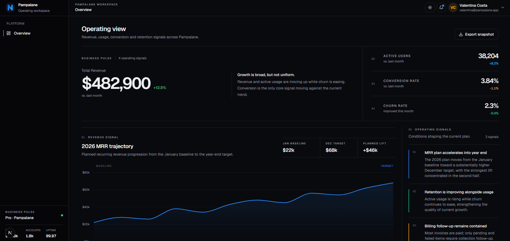

# StudioGrid Pro — SaaS Dashboard Starter

A focused, responsive SaaS dashboard starter built with Next.js, React, TypeScript and Tailwind CSS.

This free starter includes a complete dashboard shell, operational metrics, a Recharts visualization, recent account data, light and dark themes, and responsive navigation.

It is designed as a clean starting point for SaaS products, admin interfaces and internal tools without including the full workflows and multi-page structure of the StudioGrid Pro SaaS Dashboard Kit.

> This is a frontend starter. It does not include authentication, a database, backend APIs or payment processing.

## Preview



---

## What's Included

- Responsive application shell
- Desktop sidebar
- Mobile navigation drawer
- Sticky topbar
- Light and dark themes
- Persistent theme preference
- Dashboard overview
- Operational KPI metrics
- Revenue chart
- Operating signals
- Recent accounts table
- Activity log
- CSV snapshot export
- Reusable UI components
- TypeScript source code
- Responsive layouts

---

## Tech Stack

- Next.js 16
- React 19
- TypeScript
- Tailwind CSS 4
- Base UI
- Recharts
- Lucide React

---

## Requirements

- Node.js 20.9 or newer
- pnpm

---

## Installation

Extract the project and open the folder in your terminal.

Install dependencies:

```bash
pnpm install
```

Start the development server:

```bash
pnpm dev
```

Then open:

```text
http://localhost:3000
```

---

## Available Commands

```bash
pnpm dev
```

Starts the local development server.

```bash
pnpm lint
```

Runs ESLint across the project.

```bash
pnpm build
```

Creates a production build.

```bash
pnpm start
```

Runs the compiled production application.

---

## Project Structure

```text
app/
├── (dashboard)/
│   ├── layout.tsx
│   └── page.tsx
├── globals.css
└── layout.tsx

components/
├── dashboard/
│   ├── app-shell.tsx
│   ├── overview-chart.tsx
│   ├── page-header.tsx
│   ├── recent-accounts.tsx
│   ├── sidebar.tsx
│   ├── theme-toggle.tsx
│   └── topbar.tsx
├── ui/
└── theme-provider.tsx

lib/
├── dashboard-data.ts
└── utils.ts

public/
```

---

## Themes

The starter includes light and dark themes.

Theme colors are defined in:

```text
app/globals.css
```

Theme behavior is handled by:

```text
components/theme-provider.tsx
components/dashboard/theme-toggle.tsx
```

The selected theme is stored locally in the browser and restored when the application loads again.

---

## Responsive Layout

The dashboard shell is designed for desktop, tablet and mobile layouts.

The sidebar becomes a mobile drawer on smaller screens while the main dashboard content adapts to the available width.

When customizing the interface, review it at several breakpoints rather than designing only for desktop.

---

## Customizing the Starter

Start with these files:

```text
app/(dashboard)/page.tsx
components/dashboard/sidebar.tsx
components/dashboard/topbar.tsx
components/dashboard/overview-chart.tsx
lib/dashboard-data.ts
app/globals.css
```

You can replace:

- Pampalane demo branding
- Dashboard copy
- Metrics
- Chart data
- Account data
- Activity data
- Theme colors
- Navigation content

The included demo data can be replaced with API responses, server actions, database queries or your own static data.

---

## Frontend-Only Scope

This starter provides frontend UI and browser-based demo behavior.

It does not include:

- Production authentication
- Database integration
- Backend APIs
- Payment provider integration
- Email delivery
- File storage
- Production authorization
- Real-time notification delivery

Connect the interface to the services and backend architecture used by your own application.

---

## Need the Complete Version?

The full StudioGrid Pro SaaS Dashboard Kit includes additional screens, reusable components, persistent demo workflows, cross-screen state, richer datasets and a more complete SaaS product structure.

The SaaS UI Bundle also includes the Auth & Onboarding UI Kit and the Billing & Subscription UI Kit alongside the complete dashboard.

For the complete products, visit:

https://studiogridpro.com

---

## License

Personal and commercial use is permitted under the included `LICENSE.md`.

You may use and modify the starter inside your own projects and client projects.

Redistribution, resale, republishing and distribution as another template, starter kit or downloadable source product are not permitted.

Review `LICENSE.md` before using or distributing the source files.

---

## StudioGrid Pro

Premium UI kits for modern web products built with Next.js, React, TypeScript and Tailwind CSS.

https://studiogridpro.com
